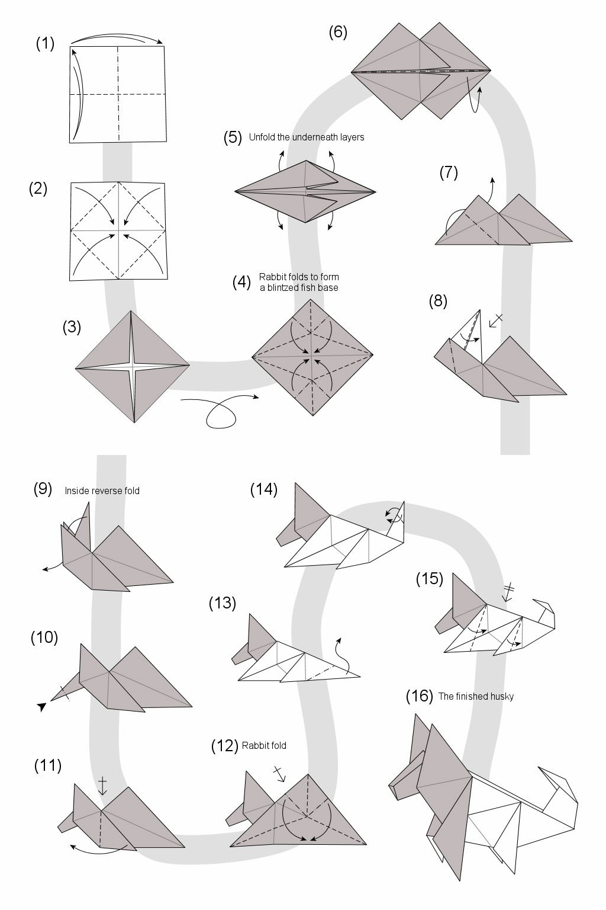

# Origami as a programming tool

I think Origami offers a lot as a teaching tool for programming.

* It gives visual instructions to reach a desired end
* Easy to correct mistakes
* It is a tangible task, both visually and physically

## Article Link

5 Reasons Why Origami Improves Students' Skills

* <https://www.edutopia.org/blog/why-origami-improves-students-skills-ainissa-ramirez>

## Sample Origami

